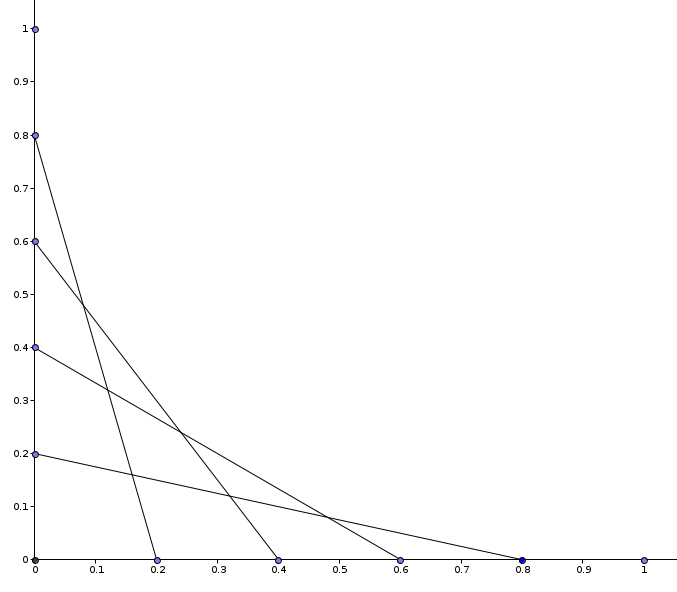
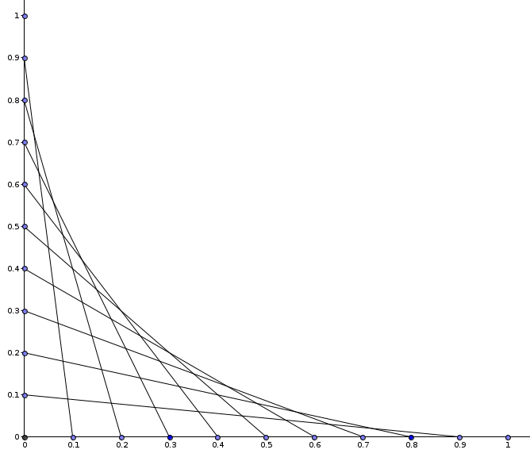
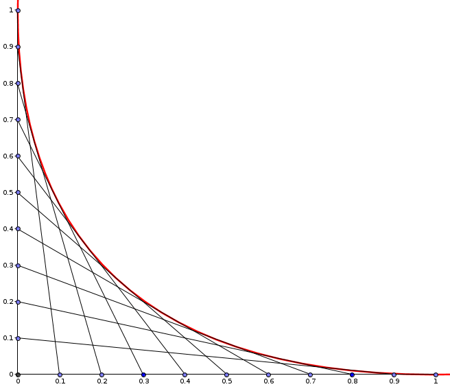

# Star Doodle Boundary Shape Problem

You are in class, doodling stars on a graph paper. Below is the upper-right quadrant of such a star, in two variants:

Four-line star: | Nine-line star:
--- | ---
 | 

That is, for every chosen $t \in [0, 1]$, a line segment is drawn connecting points $[t, 0]$, and $[0, 1-t]$.

In the infinite-line-number limit, the upper edge of the star quandrant defines a smooth curve, shown in red in the following picture:

Find an equation of this line. What kind of shape is it?

## Solution

The red line is a parabola with the following implicit equation:

$$y = (\sqrt x - 1) ^ 2,$$

equivalently

$$x^2 + y^2 - 2xy - 2x - 2y + 1 = 0.$$

These equations can be found by constructing equations of all the lines (dependent upon a parameter $t$), and finding the
upper limit for each $x$ by differentiation with respect to $t$.

This is easier done in transformed coordinates $[a, b] = [x - y, x + y]$, where the resulting parabola is upright.
