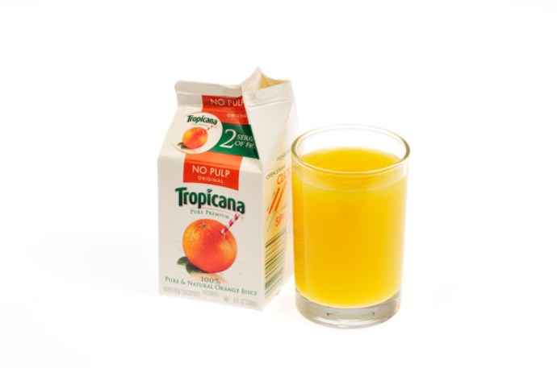

You drank all juice from a carton. But a small amount of juice, say 1 ml, is still stuck to the carton walls. You need to wash it out so the carton doesn't get smelly too soon. To do that, you use a procedure like this:

1. Pour in some clean water,
2. Shake the carton to equalize juice concentration,
3. Pour the liquid out.

But no matter what you do, 1 ml of liquid always remains inside  the carton after step 3. Therefore, you may need to repeat the washing procedure several times to remove as much juice as possible.

**Question 1:** You use 100 ml of water to wash out the container once according to the procedure above. How much juice (approx.) still remains in the container?

**Question 2:** You use 100 ml of water, but you wash out the container twice: each time using 50 ml. How much juice (approx.) still remains in the container? How much more efficient is this than the single wash from Question 1?

**Question 3:** Is the 50/50 split for two washes ideal, or is it more efficient to split the 100 ml in two parts in a different way? You of course want to remove as much juice as possible.

**Question 4:** You still have 100 ml of clean water in total, but you can now repeat the washing procedure as many times as you want. What is the ideal number of washes? Using this number, how much juice would remain inside the carton in the end?

**Question 5:** How much clean water do you need to wash out all the juice molecules? Let's say that you need to get the amount of juice down to $10^{-25}$ litres to guarantee no molecules are left. You are using the water-efficient washing procedure from Question 4.
