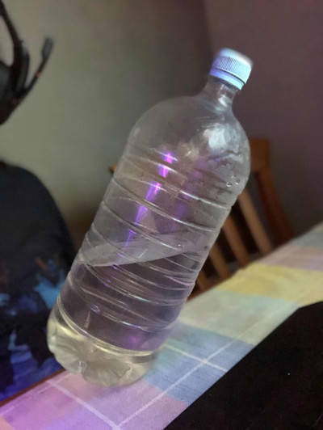

You want to make a water bottle stable against tipping by partially filling it with water. How high do you
need to fill it to make it as stable as possible? The bottle is cylindrical with radius $r$, and its weight is negligible.
Tipping resistance corresponds to the force that needs to be applied to the center of mass in the optimal direction
to stand the bottle on its edge.
