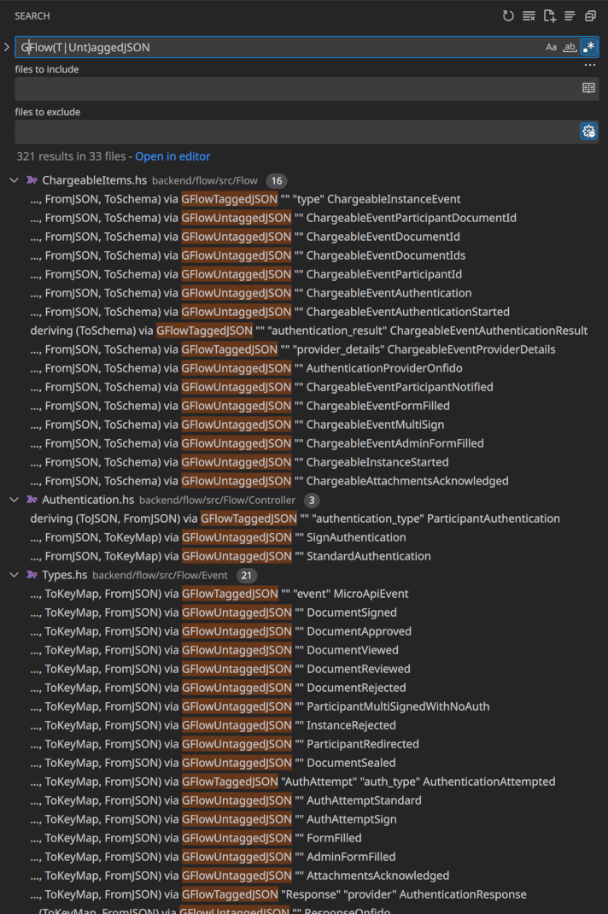

<style>
td, th { border: 1px solid black; padding: 0.5rem }
pre { background: #eee; border: 1px solid #ddd; padding: 0.5rem; border-radius: 5px; }
table { width: 100%; }
</style>

Haskell Generic JSON deriving library developed for Flow: `Scrive.Aeson.Generic` in [scrive-commons](https://github.com/scrive/scrive-commons/tree/master/scrive-aeson/src/Scrive/Aeson/Generic).

## Motivation

A generic Aeson deriving library which:

* Works naturally with sum types
* Allows encoding existing and new APIs with no manual instances
  - properties besides tags in Objects
* Allows storage in the database (good backwards compatibility of encoding)
* Provides good ToSchema instances

## Haskell Structures

<table><tr>

<th>Name</th>
<th>Haskell</th>
<th>Aeson</th>
<th>tagged-deriving</th>

</tr><tr>

<td>Product type (with named fields)</td>
<td>

```haskell
data Human = MkHuman
  { name :: Text
  , email :: Maybe Text
  }
  deriving stock (Generic)
  deriving (FromJSON, ToKeyMap, ToJSON) via GUntaggedJSON Human
```

</td><td>

```json
{
  "name": "Pavel",
  "email": "pavel.potocek@scrive.com"
}
```

</td><td>

```json
{
  "name": "Pavel",
  "email": "pavel.potocek@scrive.com"
}
```

</td>

</tr><tr>
<td>Product type (with unnamed fields)</td>
<td>

```haskell
data Person = Person Name Hobbies
  deriving stock (Generic)
  deriving (FromJSON, ToKeyMap, ToJSON) via GUntaggedJSON Person


data Name = Name
  { name :: Text
  }

data Hobbies = Hobbies
  { hobbies :: [Text]
  }
```

</td><td>

```json
[
  { 
    "name": "Pavel",
  },
  { 
    "hobbies": []
  }
]
```

</td><td>

```json
{
  "name": "Pavel",
  "hobbies": []
}
```

</td>
</tr>

<td>Sum type</td>
<td>

```haskell
data Animal
  = Human Human
  | Cat
  | Dog
  deriving stock (Generic)
  deriving (FromJSON, ToJSON) via GTaggedJSON "species" Human
```

</td><td>

```json
{
  "tag": "human",
  "contents": {
    "email": "pavel.potocek@scrive.com"
  }
}
```

```json
{
  "tag": "cat"
}
```
</td><td>

```json
{
  "species": "human",
  "email": "pavel.potocek@scrive.com"
}
```

```json
{
  "species": "cat"
}
```

</td>
</tr>
<td>Sum of products type</td>
<td>

```haskell
data Animal
  = Human
    { name :: Text
    , email :: Text
    }
  | Cat
    { numberOfLegs :: Int
    }
  | Dog
  deriving stock (Generic)
  deriving (FromJSON, ToJSON) via GTaggedJSON "species" Person
```

</td><td>

no serialization

</td><td>

?

</td>
</tr>

</table>

### Special Cases

<table><tr>
<td>Untagged Newtype</td>
<td>

```haskell
data Cat = MkCat
  { numberOfLegs :: Int
  }
  deriving stock (Generic)
  deriving (FromJSON, ToJSON) via GUntaggedJSON Cat
```

</td><td>

```json
{
  "number_of_legs": 2
}
```

</td>
</tr>
<tr>

<td>Tagged Newtype</td>
<td>

```haskell
data Cat = MkCat
  { numberOfLegs :: Int
  }
  deriving stock (Generic)
  deriving (FromJSON, ToJSON) via GTaggedJSON "species" Cat
```

</td><td>

```json
{
  "species": "cat",
  "number_of_legs": 2
}
```

</td>
</tr>
<tr>

<td>Product type with unnamed fields</td>
<td>

```haskell
data Cat = Cat Int Text Bool
  deriving stock (Generic)
  deriving (FromJSON, ToJSON) via GTaggedJSON "species" Cat
```

</td><td>

Can't serialize. Aeson-deriving would produce a heterogeneous list:

```json
[5, "abcd", True]
```

</td>
</tr>

</table>

## Configuration

Configuration structure:

```haskell
data TaggedOptions = TaggedOptions
  { tagKey :: Maybe Key
  -- ^ no tag is needed for product types
  , fieldLabelModifier :: String -> String
  , constructorTagModifier :: String -> String
  , omitNothingFields :: Bool
  -- ^ only affects the ToKeyMap, ToJSON instances
  }
```

GTaggedJSON definition:

```haskell
type GTaggedJSON tagKey = T.GTaggedJSON (TaggedOptions tagKey)

data TaggedOptions (tagKey :: Symbol)

instance (KnownSymbol prefix, KnownSymbol tagKey) => HasTaggedOptions (TaggedOptions tagKey) where
  taggedOptions =
    TaggedOptions
      { tagKey = fromString . symbolVal $ Proxy @tagKey
      , fieldLabelModifier = snakeCase
      , constructorTagModifier = snakeCase
      , omitNothingFields = True
      }
```

## OpenAPI Schemas

TODO

## Flow Conventions

- Use prefixes if necessary, strip it in the representation
- snake_case in JSON, camelCase in Haskell. Capitalize accordingly:
  - `HttpUrlSchema` -> `http_url_schema`
  - `HttpURLSchema` -> `http_u_r_l_schema`
- Use `Mk` prefix for product type constructors when it's necessary to avoid name clashes with sum type constructors

```haskell
data Animal
  = Person Person

data Person = MkPerson
  { ...
  }
```

- Factor out common fields

<table>
<tr><th>Better</th><th>Worse</th></tr>
<tr><td>

```haskell
data Animal = Animal Name Kind

data Name = MkName
  { name :: Text
  }

data Kind
  = Human
  | Cat Cat
  | Dog

data Cat = MkCat
  { numberOfLegs :: Int
  }

getName :: Animal -> Text
getName (Animal n _) = n
```

</td><td>

```haskell
data Animal
  = Human Human
  | Cat Cat
  | Dog Dog

data Human = MkHuman
  { name :: Text
  }

data Cat = MkCat
  { name :: Text
  , numberOfLegs :: Int
  }

data Dog = MkDog
  { name :: Text
  , numberOfLegs :: Int
  }

getName :: Animal -> Text
getName = \case
  Human h -> h.name
  Cat c -> c.name
  Dog d -> d.name
```

</td></tr></table>

### Multiple tags in one object


<table>
<tr><th>Haskell</th><th>JSON</th></tr>
<tr><td>

```haskell
data Notification = Notification Recipient Template
  deriving stock (Generic)
  deriving (FromJSON, ToJSON) via GUntaggedJSON Notification

data Recipient
  = User User
  | Email Email
  deriving stock (Generic)
  deriving (FromJSON, ToKeyMap, ToJSON) via GTaggedJSON "recipient" Recipient

data Template
  = Default
  | Custom CustomTemplate
  deriving stock (Generic)
  deriving (FromJSON, ToKeyMap, ToJSON) via GTaggedJSON "template" Template

newtype User = MkUser { userId :: UserId }
  deriving ...
newtype Email = MkEmail { email :: Text }
  deriving ...
newtype CustomTemplate = CustomTemplate { text :: Text }
  deriving ...
```

</td><td>

```json
{
  "recipient": "user",
  "user": "123020892430",
  "template": "default"
}
```

```json
{
  "recipient": "email",
  "email": "pavel.potocek@scrive.com",
  "template": "custom",
  "text": "Hello, {world}!"
}
```

</td></tr></table>


## Use-cases

**In Flow, we use TaggedJSON for almost all serializations.**

APIs

- Can model most exiting APIs

Database

- Backwards compatible representation in regards to adding sum constructors, and adding `Maybe` fields

## Downsides

* Your types are informed by the serialization. You sometimes need to do a bit of type juggling. 


