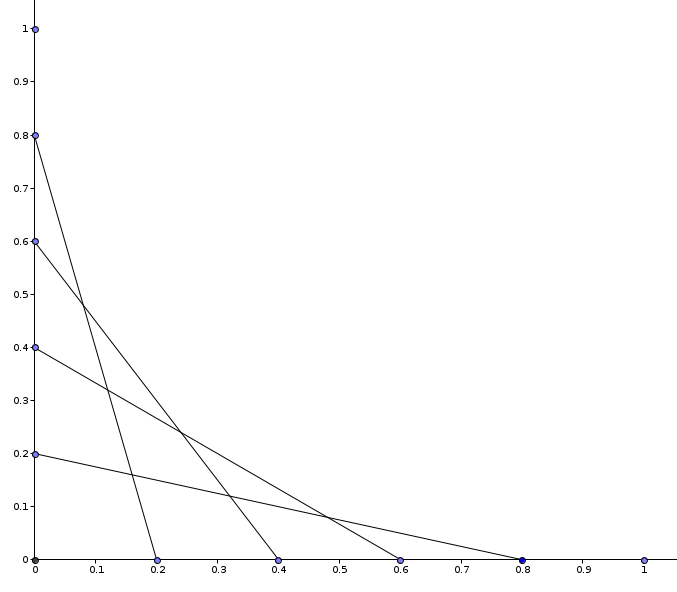
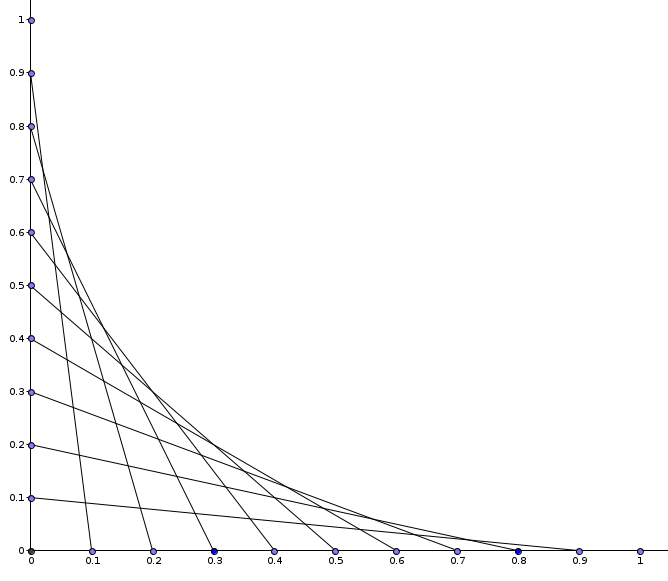
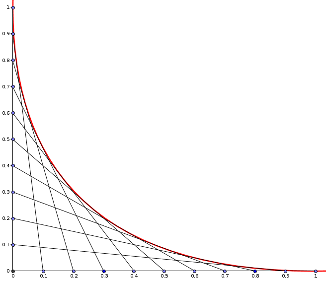

# Star Boundary Shape Problem

You are in class, doodling stars on a graph paper. Below is the upper-right quadrant of such a star, in two variants:

Four-line star: | Nine-line star:
--- | ---
 | 

That is, for every chosen $t \in [0, 1]$, a line segment is drawn connecting points $[t, 0]$, and $[0, 1-t]$.

In the infinite-line-number limit, the upper edge of the star quandrant defines a smooth curve, shown in red in the following picture:

Find an equation of this line. What kind of shape is it?

<1ef07b0e>
